# Results

## Circuit 3

## Pre-processing

Convert image to grayscale

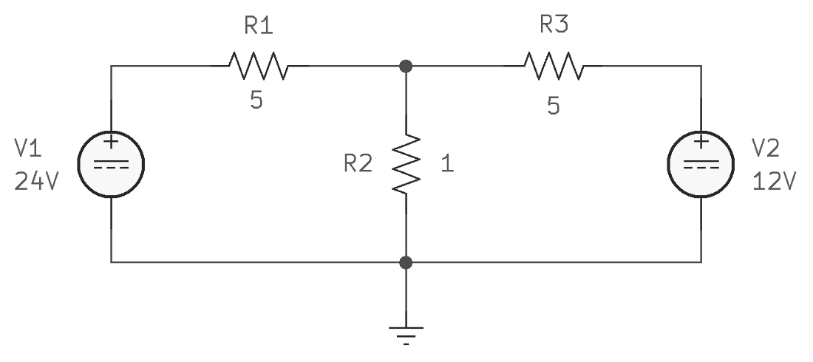

Gaussian blur

Adaptive threshold

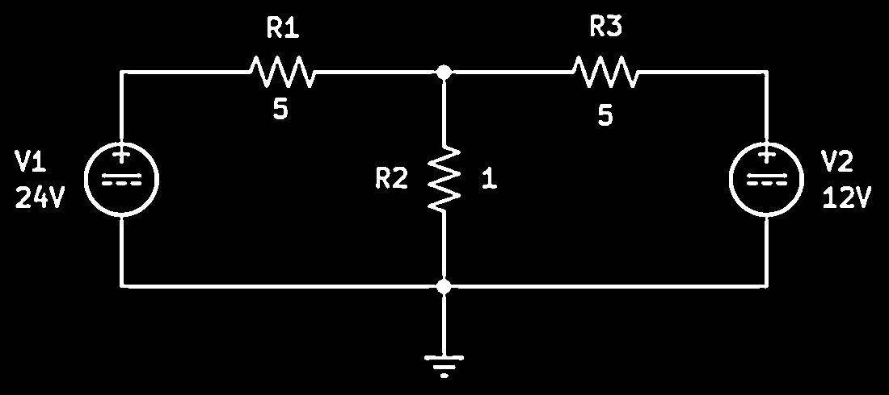

Morphological dilation

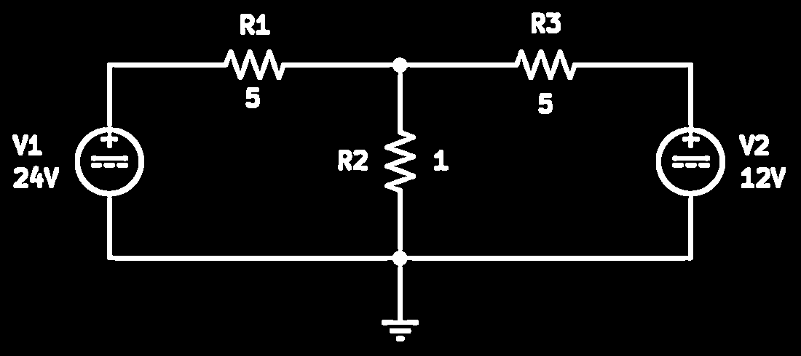

Thinning operation

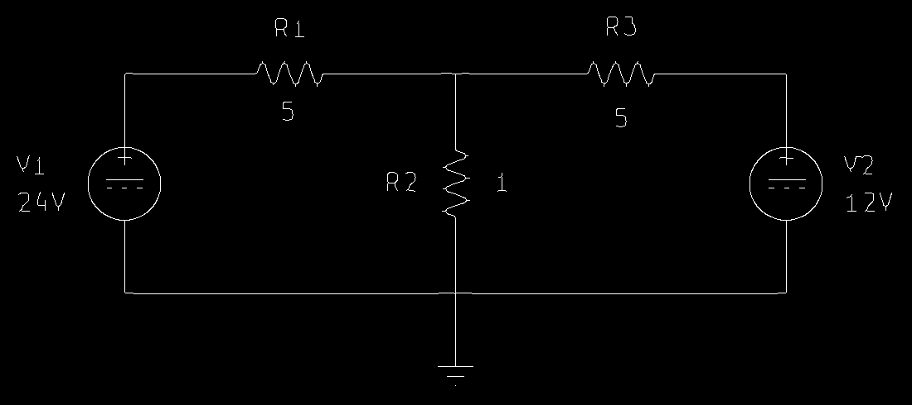

## Segmentation

### Detection of connections

Morphological closing

Morphological opening

Intersection between the preprocessed image and the image without connections

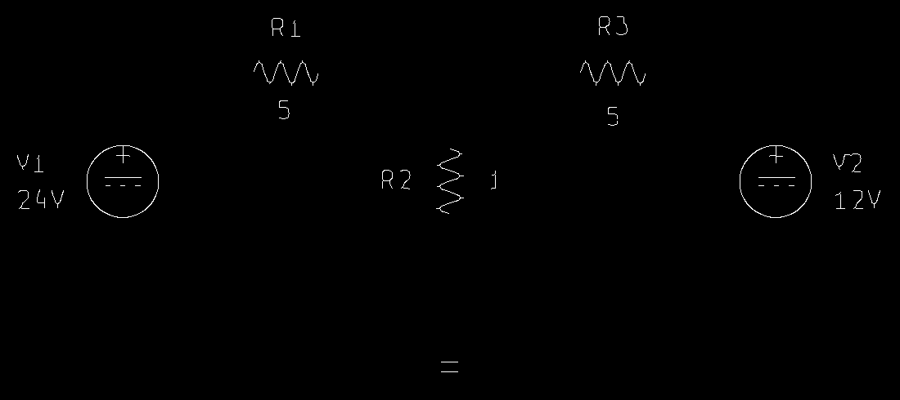

Image with only the circuit connections

Detected connections

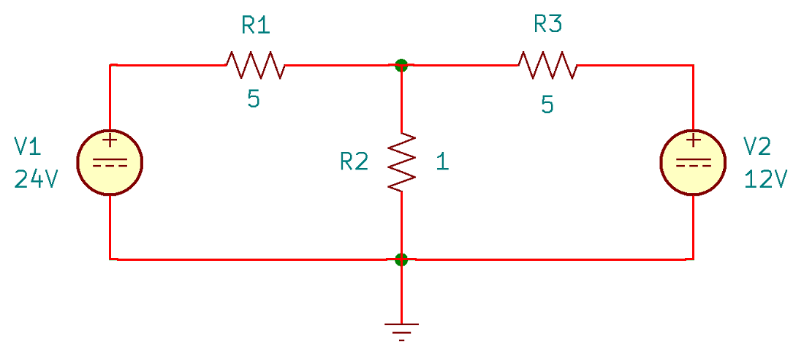

### Detection of components

Remove connections

Morphological closing

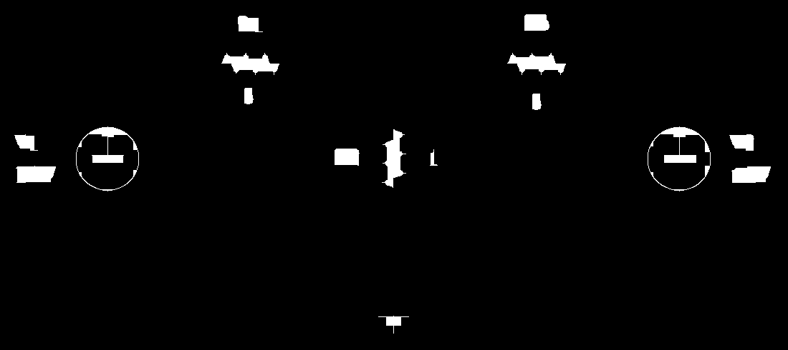

Detected components

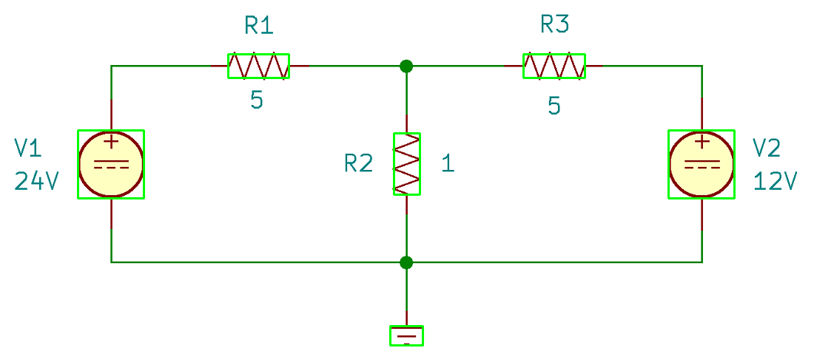

### Update of detected connections

Remove components

Updated connections

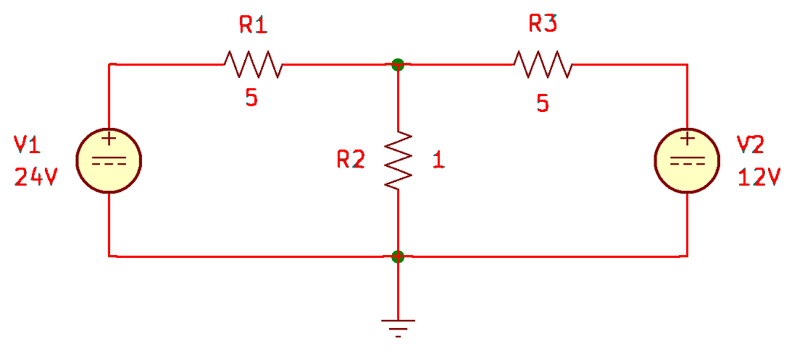

### Detection of nodes and update of connections

Detected nodes and updated connections

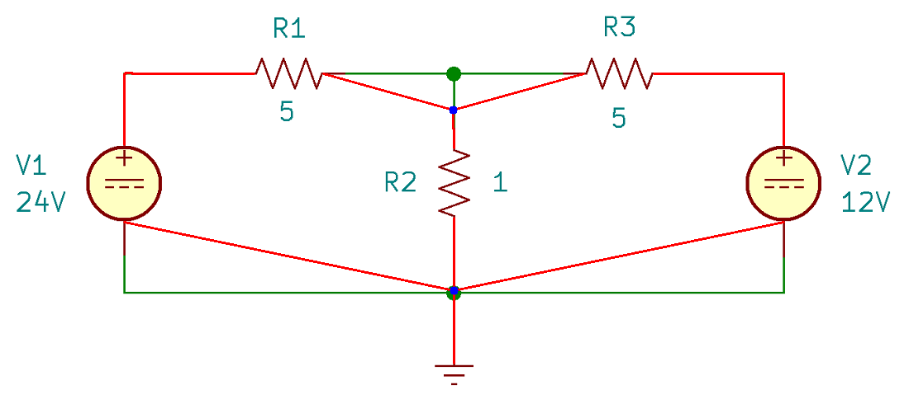

### Detection of connection points (ports) of components

Detected ports of components

### Update list of detected components

Images with regions of interest (ROI) for components [here](./assets/)

### Detection of labels

Remove elements

Morphological closing

Morphological opening

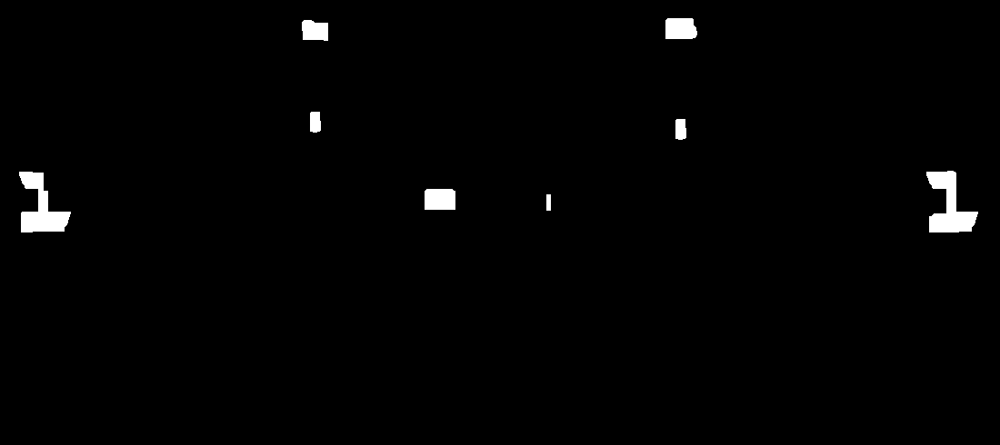

Detected labels

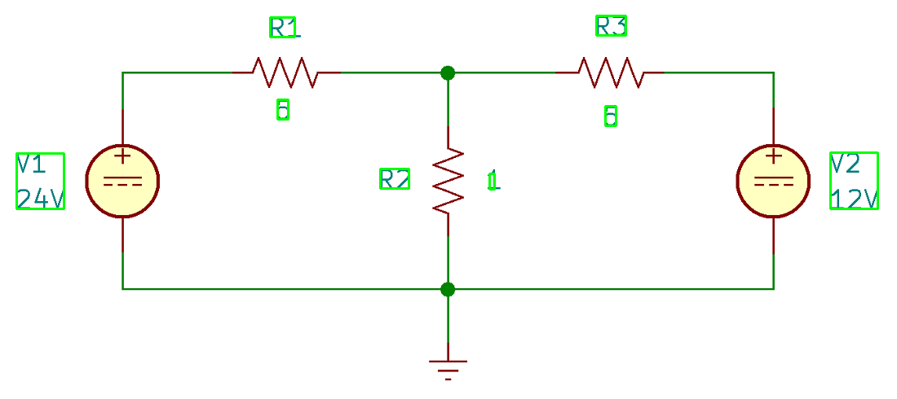

### Association of labels to the elements of the circuit

Boxes for connections and nodes

Images with ROI for labels with associated element ID [here](./assets/)

## Generation of images with regions of interest for components and labels

Images with ROI for components and labels [here](./assets/)

## Generation of segmentation map

[Map](./assets/segmentation_map.json)
